<div align="center">
  
  <h1>AmbuLink</h1>
  <p><strong>Smart Ambulance Booking System — Reducing Emergency Response Time Across Uganda</strong></p>

  [](https://nextjs.org)
  [](https://supabase.com)
  [](https://vercel.com)
  [](LICENSE)
</div>

---

## 📌 Overview

AmbuLink is a digital emergency response platform that connects patients, institutions, highway users, and remote communities across Uganda with the nearest available registered ambulance driver — in real time.

Developed by students at **Kampala International University**, AmbuLink addresses a critical national public health gap: the complete absence of a coordinated, digital ambulance dispatch system in Uganda. Every year, hundreds of preventable deaths occur because no one could find an ambulance in time. AmbuLink exists to change that.

> *"This is not just a software project — it is a response to a national health emergency challenge, designed by Ugandan students for the benefit of Ugandan communities."*

## 🧠 What Makes AmbuLink "Smart"?

AmbuLink replaces the delays of human decision-making with the speed of mathematical algorithms.

1. **Autonomous Dispatcher**: Uses the Haversine formula and OSRM routing to instantly match emergencies with the nearest active driver in `<180ms`.
2. **Predictive Appointment Logic**: The system "wakes up" 30 minutes before a scheduled trip to scan the fleet and auto-assign a driver without human intervention.
3. **Database Self-Awareness**: Uses PostgreSQL triggers to monitor status changes. The system "knows" when a driver arrives at a scene and pushes real-time alerts to patients automatically.
4. **Intelligent Triage**: Automatically prioritizes high-impact SOS requests over routine transport using role-based priority flagging.

---

## 📸 Screenshots

### Landing Page

The public-facing marketing page introduces AmbuLink's value proposition — real-time tracking, sub-10-minute average response, and verified drivers. Visitors can register as a driver or institution directly from here.

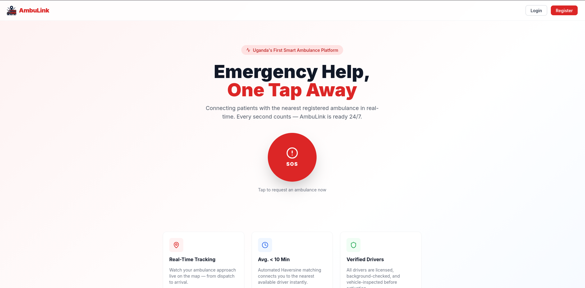

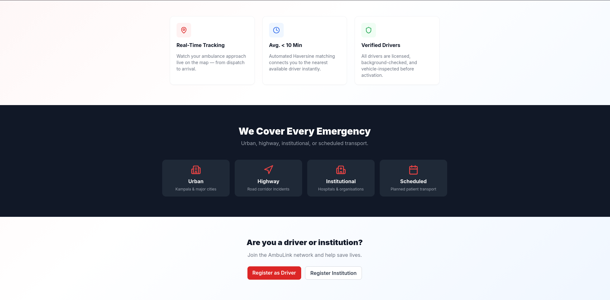

---

### Login

All users (patients, drivers, and admins) sign in through a single clean login screen. Role-based routing takes each user to their dedicated dashboard after authentication.

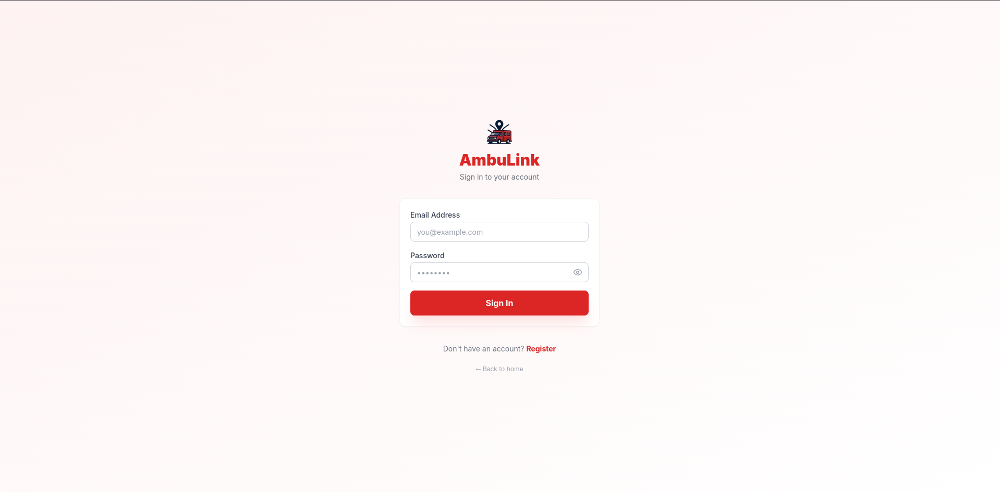

---

## 🧑‍⚕️ Patient Portal

### My Bookings

Patients can view their full booking history across all booking types: Emergency, Scheduled, Institutional, and Highway. Each booking shows the reference number, type, status, pickup location, destination, fare, and timestamp.

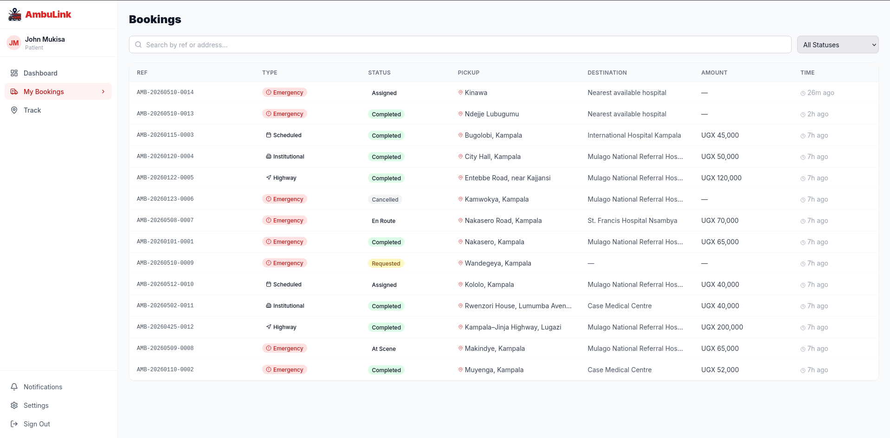

---

### Live Tracking

Once an ambulance is dispatched, patients see a full-screen Leaflet map with the driver's live position and the OSRM-calculated route to their location. A large red countdown card shows estimated arrival time (MM:SS), live velocity in KM/H, and distance remaining.

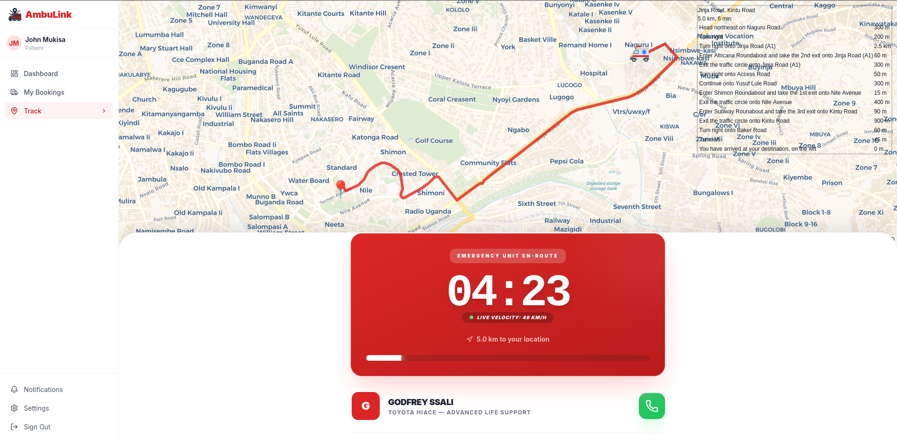

When there is no active trip, the tracking page gracefully shows a "No Active Trip" state with a return-home prompt.

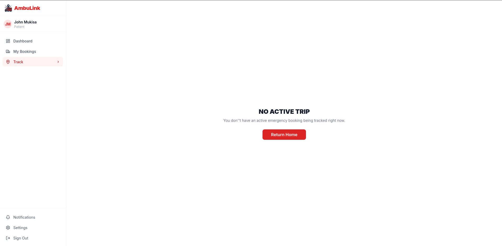

---

### Settings

Patients can update their personal information (name, phone number), change their password, and manage notification preferences — including booking updates and promotional alerts.

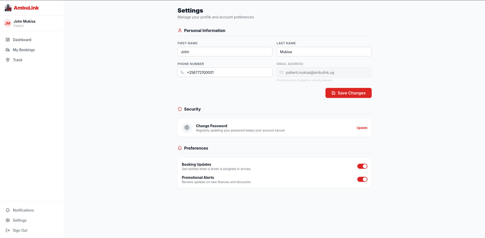

---

## 🚑 Driver Portal

### Driver Dashboard — Online with Active Job

When a driver goes online, the header turns green and shows their ambulance ID. The dashboard displays their rating, total trips, and driver level (Basic / Pro / Neonatal / Advanced). Active jobs appear with a live mini-map showing the patient's pickup location, the pickup address, destination, and action buttons to call the patient, open navigation, or start the en-route timer.

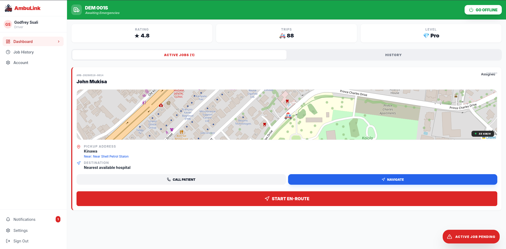

---

### Driver Dashboard — Job History

When there are no active jobs, drivers can browse their completed trip history, each card showing the patient name, pickup address, destination, and completion status.

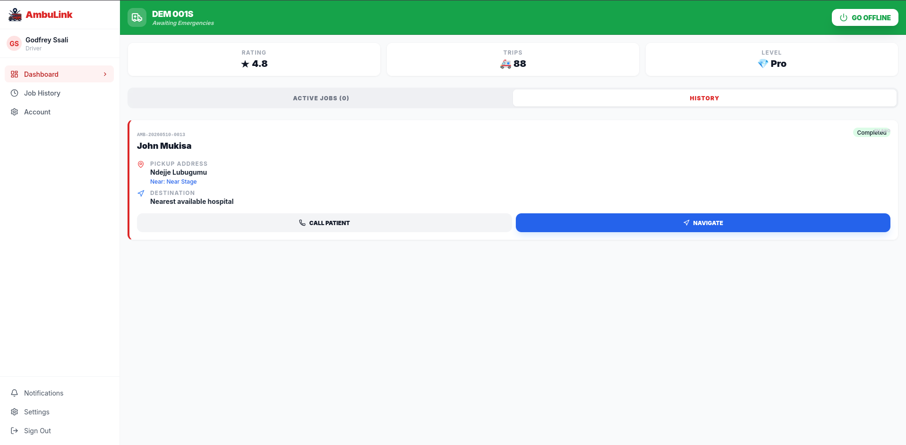

---

## 🛡️ Admin Portal

### Admin Dashboard

The admin command centre shows live stats at a glance: today's bookings, trips completed, total registered drivers, and institutional accounts. A red banner fires when there are unassigned emergencies awaiting dispatch, linking directly to the dispatch centre. A yellow banner highlights pending institution approvals.

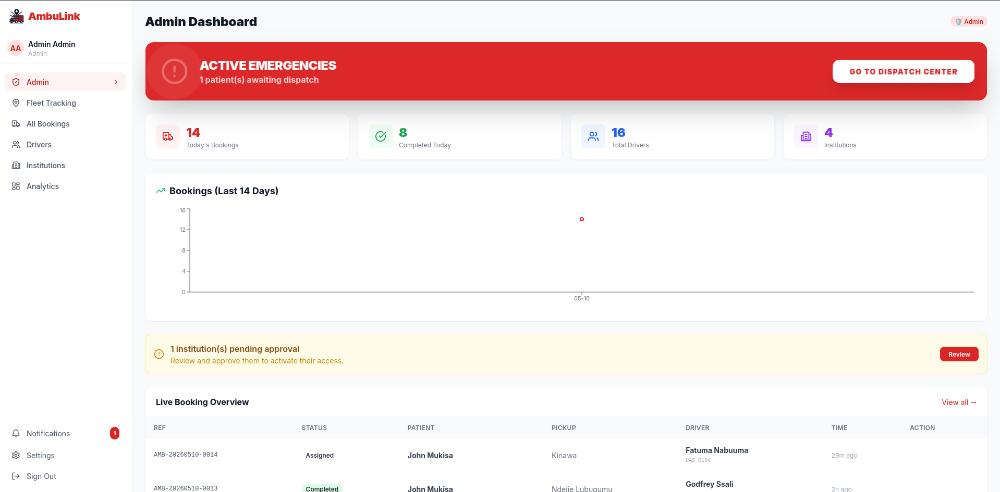

---

### Fleet Tracking

A full-screen Leaflet map displays every online ambulance as a real-time icon across the Kampala metro area. A sidebar lists all active ambulances by driver name, plate, and vehicle type. Status counters at the top show how many units are online and how many active SOS calls are in progress.

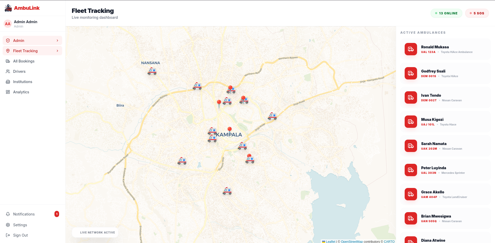

---

### All Bookings

Admins can view, search, and filter every booking in the system. Each row shows the reference, booking type, status (colour-coded), patient, pickup, assigned driver, plate, fare, and time. Priority bookings are flagged with a red badge. Bookings waiting for a driver have an inline "Assign Driver" button.

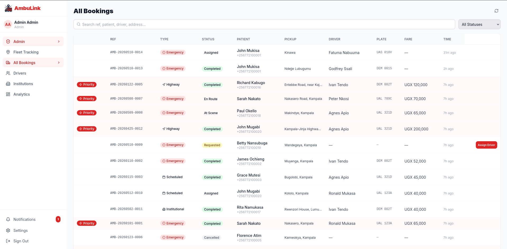

---

### Drivers

A searchable, paginated table of all 16 registered drivers shows their plate, vehicle type, zone, trip count, star rating, account status (active / suspended), and real-time online indicator. Admins can suspend a driver with a single click.

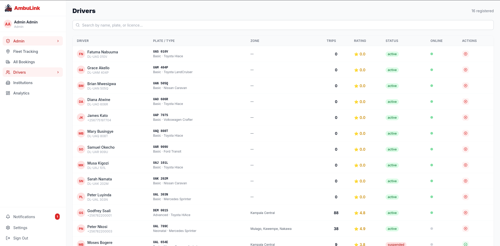

---

### Institutions

Admins manage registered institutions — hospitals, government bodies, schools, and corporates. Pending institutions are highlighted with an amber border and Approve / Reject action buttons. Active institutions show their contact details and website link.

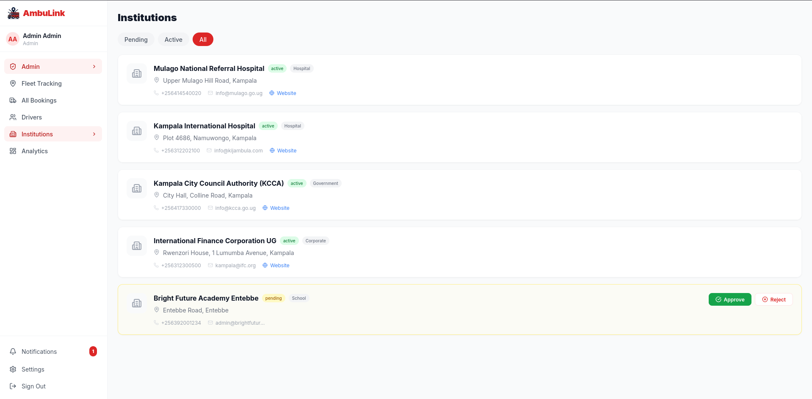

---

### Analytics

The analytics page surfaces key performance indicators: total bookings, total revenue (UGX), completed trips, and average assignment time. Charts display daily bookings and revenue over the last 30 days, booking type distribution (Emergency, Scheduled, Highway, Institutional), average response time, and average trip distance.

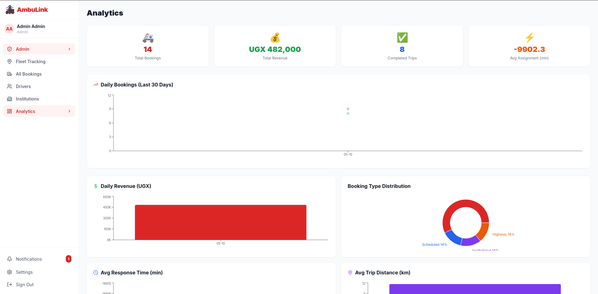

---

### Notifications

System-level alerts are surfaced in a dedicated notifications panel. Admins see events such as driver suspensions and unassigned emergencies waiting beyond the SLA threshold.

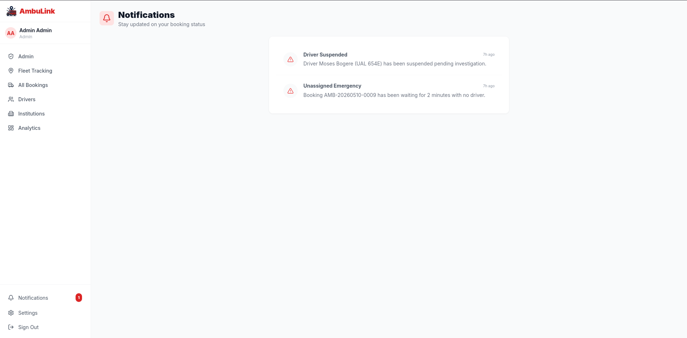

---

## 🌍 Who AmbuLink Serves

| Context | Description |
|---|---|
| 🏙️ **Urban** | Kampala, Entebbe, Jinja, Mbarara, Gulu, Mbale |
| 🛣️ **Highways** | Kampala–Jinja, Kampala–Masaka, Kampala–Gulu, Kampala–Mbarara |
| 🏢 **Institutions** | Banks, hotels, factories, markets, schools, sports facilities, government offices |
| 🌾 **Remote Areas** | Karamoja, Bundibugyo, Kasese, and other underserved districts |

---

## ✨ Key Features

- **One-Tap SOS Emergency Booking** — GPS-detected location, instant driver dispatch
- **Automated Nearest-Driver Matching** — Haversine algorithm, <180ms match time
- **Real-Time Leaflet & OSRM Tracking** — Live ambulance location with high-precision OSRM routing
- **Live Velocity Simulation** — Real-time speed monitoring (KM/H) for both patient and driver
- **"Big Hero" Countdown Clock** — Digital-style MM:SS countdown with route recalculation
- **Scheduled Booking Engine** — Future-date transport with automated driver assignment 30 mins before pickup
- **Real-time Status Triggers** — Database-level notifications for "At Scene", "En Route", and "Assigned" events
- **Institutional Emergency Portal** — Priority dispatch for registered organisations
- **Highway Accident Reporting** — GPS pin-drop for road corridor incidents
- **Global Action Pattern** — Persistent "Schedule" access from any page via unified TopBar
- **Admin Dashboard** — Analytics, driver management, audit logs, and reporting
- **Role-Based Access Control** — Patients, drivers, institutional reps, and admins
- **Push Notification System** — Firebase Cloud Messaging & In-App real-time alerts for all booking events

---

## 🧱 Tech Stack

| Layer | Technology |
|---|---|
| Web Frontend | Next.js 14 (App Router), React, TypeScript |
| Styling | Tailwind CSS, Shadcn UI |
| Backend / API | Next.js API Routes, Node.js Runtime |
| Database | Supabase (PostgreSQL 15) |
| Auth | Supabase Auth |
| Real-Time | Supabase Realtime |
| Storage | Supabase Storage |
| Maps | Leaflet.js / OpenStreetMap / CartoDB |
| Routing | OSRM (Open Source Routing Machine) |
| Notifications | Firebase Cloud Messaging (FCM) |
| Hosting | Vercel + GitHub CI/CD |
| Version Control | Git, GitHub |

---

## 🚀 Getting Started

### Prerequisites

- Node.js 18+
- npm or yarn
- Supabase CLI
- Firebase project (for FCM)

### 1. Clone the Repository

```bash
git clone https://github.com/your-org/ambulink.git
cd ambulink
```

### 2. Install Dependencies

```bash
npm install
```

### 3. Configure Environment Variables

Create a `.env.local` file in the project root:

```env
NEXT_PUBLIC_SUPABASE_URL=your_supabase_project_url
NEXT_PUBLIC_SUPABASE_ANON_KEY=your_supabase_anon_key
SUPABASE_SERVICE_ROLE_KEY=your_service_role_key
FCM_SERVER_KEY=your_firebase_server_key
```

### 4. Start Local Supabase Stack

```bash
supabase start
supabase db push
supabase db seed
```

### 5. Run the Web Application

```bash
npm run dev
```

Open [http://localhost:3000](http://localhost:3000)

---

## 🔑 Demo Credentials

> ⚠️ For evaluation and demonstration only. Change all passwords before any production deployment.

| Role | Email | Password |
|---|---|---|
| Admin | admin@ambulink.ug | ambulink@2026 |
| Driver | driver.ssali@ambulink.ug | ambulink@2026 |
| Patient / User | patient.mukisa@ambulink.ug | ambulink@2026 |

---

## ⚙️ Backend Logic

### Scheduled Dispatch Engine
Scheduled bookings remain in a `requested` status until 30 minutes before the pickup time. A PostgreSQL background process (compatible with `pg_cron`) calls `fn_process_scheduled_bookings()`, which:
1. Identifies bookings due within 30 minutes.
2. Runs the **Nearest Driver Algorithm** to find available units.
3. Auto-assigns the driver and triggers a patient notification.

### Automated Notifications
The system uses a database trigger `trg_booking_status_notifications` to eliminate the need for manual API-level notification code. Any status update on the `bookings` table (via Driver App, Admin Panel, or Auto-Dispatch) instantly creates an entry in the `notifications` table, which is pushed to the frontend via **Supabase Realtime**.

---

## 📁 Project Structure

```
ambulink/
├── public/
│   ├── images/
│   │   └── icon.png               # App icon
│   └── screenshots/               # UI screenshots
├── app/                           # Next.js App Router pages
│   ├── (auth)/                    # Login, register
│   ├── dashboard/                 # User dashboard + SOS
│   ├── bookings/                  # Booking management
│   ├── track/                     # Real-time tracking map
│   ├── institution/               # Institutional portal
│   └── admin/                     # Admin dashboard
├── components/                    # Shared UI components
├── lib/                           # Utilities, Supabase client, algorithms
└── supabase/
    ├── migrations/                # Database schema migrations
    └── seed.sql                   # Demo seed data
```

---

## 🔐 Security

- **Row-Level Security (RLS)** enforced at database layer on all tables
- **Role-Based Access Control (RBAC)** on every API route
- **Supabase Auth** with encrypted session tokens
- **Environment secrets** stored in Vercel encrypted variables — never committed to the repository
- **Audit logs** tracking all booking and admin actions
- **GPS spoofing detection** at API layer

---

## 🧪 Testing Summary

| Test Type | Tests | Passed | Result |
|---|---|---|---|
| Unit Testing | 44 | 44 | ✅ PASS |
| Integration Testing | All modules | All | ✅ PASS |
| Security Testing | 7 scenarios | 7 | ✅ PASS |
| Performance Testing | 6 scenarios | 6 | ✅ PASS |
| UAT (30 participants) | 5 dimensions | Avg 4.5/5 | ✅ PASS |

---

## 📊 Performance Benchmarks

| Scenario | Result | Target |
|---|---|---|
| SOS to driver notification (10 concurrent) | 2.4s | < 5s |
| Dashboard page load | 1.3s | < 3s |
| Real-time driver location refresh | < 1s | < 2s |
| Nearest-driver algorithm (50 drivers) | 180ms | < 500ms |
| Production deployment time | < 40s | — |

---

## 🗺️ Roadmap

- [ ] USSD / SMS fallback booking for areas without mobile data
- [ ] Flutter driver mobile app (Android) — in development
- [ ] iOS version of driver mobile application
- [ ] AI-powered demand forecasting and driver pre-positioning
- [ ] Vehicle telematics integration (fuel, mechanical status)
- [ ] Insurance and billing module
- [ ] Multi-country support (East Africa expansion)
- [ ] Offline-first progressive web app (PWA) mode

---

## 👨‍💻 Team

| Name | Student ID |
|---|---|
| Tumusiime Mahad | 2023-08-20137 |
| Mugisha Abdul | 2023-08-21509 |
| Kato Ashraf | 2023-08-19539 |

**Academic Supervisor:** Mr. Tumwebaze Wilson  
**Institution:** Kampala International University — School of Mathematics and Computing  
**Degree:** Bachelor of Information Technology, 2026

---

## 📄 License

This project is submitted in partial fulfilment of the requirements for the Bachelor of Information Technology degree at Kampala International University. All rights reserved © 2026 AmbuLink Team.

---

<div align="center">
  Built in Uganda 🇺🇬 · For Uganda · By Ugandans
</div>